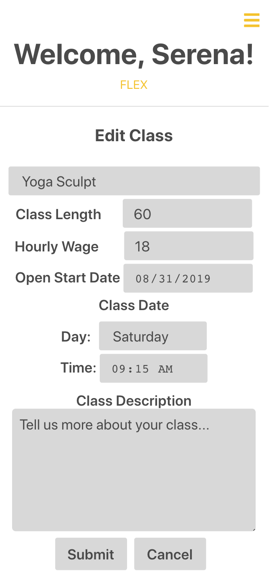

# FLEX: Connecting yoga instructors and yoga studios

This project was bootstrapped with [Create React App](https://github.com/facebook/create-react-app).

## Overview

FLEX is open for use for yoga instructors and yoga studios. Yoga instructors can view open positions posted by yoga studios. Yoga studios can post open classes at their studio and view applicants to easily contact them.

## Demo

Live demo can be found [here](https://floating-savannah-98427.herokuapp.com/)

- Instructor demo: instructor@test.com
- Studio demo: studio@test.com
- Password: password

## Screens

### Instructor Dashboard

### Studio Dashboard

